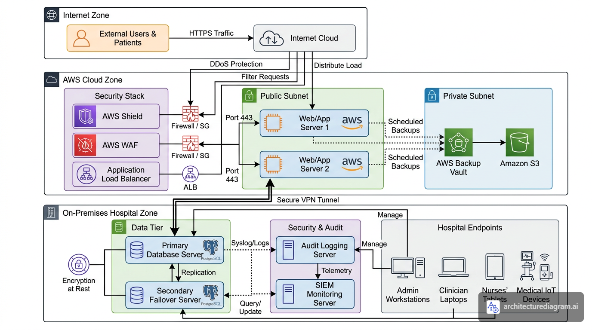

# NEXUS Electronic Health Records — System Architecture

> **NEXUS** is a hybrid Electronic Health Records (EHR) system designed to support comprehensive day-to-day healthcare operations across multi-site clinical environments. It enables healthcare providers to manage patient records, lab results, referrals, appointments, billing, and clinical documentation in a secure, centralised environment.
>
> NEXUS processes, stores, and transmits sensitive health information including **Protected Health Information (PHI)** and **Personally Identifiable Information (PII)**, making security and compliance a critical priority.

---

## System Boundary Diagram

---

## Architecture Overview

The NEXUS system is deployed across **three distinct security zones**, reflecting a hybrid cloud and on-premises model.

---

### Zone 1 — Internet Zone (External Boundary)

The untrusted public internet boundary. External users — including patients and remote clinicians — initiate **HTTPS traffic** to access NEXUS via a patient portal or clinical interface. No PHI exists in this zone; it is purely a transit path.

---

### Zone 2 — AWS Cloud Zone (Application & Security Layer)

#### Security Stack
| Component | Role |
|---|---|
| **AWS Shield** | DDoS protection at the perimeter |
| **AWS WAF** | Filters malicious web requests (SQLi, XSS) |
| **Application Load Balancer** | Distributes sessions across redundant app servers |

Traffic flow: `Internet → Shield → WAF → ALB → Firewall/SG → Port 443`

#### Public Subnet — Application Tier
- **Web/App Server 1 & 2** host the NEXUS application: clinical documentation, scheduling, billing, lab results, and referral management
- All traffic over **Port 443 (HTTPS only)**
- Dual-server setup ensures **high availability** during critical clinical workflows

#### Private Subnet — Backup & Storage
- **AWS Backup Vault** — receives scheduled backups from both app servers
- **Amazon S3** — long-term encrypted storage for documents, attachments, and PHI archives
- No inbound internet path — isolated cold-storage boundary

---

### Zone 3 — On-Premises Hospital Zone (Data & Compliance Layer)

Connected to AWS via a **Secure VPN Tunnel** — PHI is never transmitted over the public internet unencrypted.

#### Data Tier
- **Primary PostgreSQL Database** — live operational store for all PHI/PII (records, notes, labs, billing)
- **Secondary Failover Server** — real-time replication target for automatic failover
- **Encryption at Rest** applied to both servers (HIPAA control)

#### Security & Audit
- **Audit Logging Server** — captures every record access, data change, and login event
- **SIEM Monitoring Server** — real-time threat detection via telemetry from audit logs

#### Hospital Endpoints
| Device | Primary NEXUS Use |
|---|---|
| Admin Workstations | Scheduling, billing, registration |
| Clinician Laptops | Documentation, prescribing, lab review |
| Nurses' Tablets | Bedside charting, medication records |
| Medical IoT Devices | Vital signs capture fed into patient records |

---

## Security & Compliance Controls

| Control | Implementation |
|---|---|
| Encryption in Transit | HTTPS/TLS Port 443 + VPN tunnel |
| Encryption at Rest | On-premises database tier |
| Access Control | Firewalls / Security Groups at every boundary |
| Audit Logging | Centralised, tamper-evident logging |
| High Availability | Dual app servers + DB replication |
| Backup & Recovery | AWS Backup Vault + S3 scheduled backups |
| Threat Detection | SIEM with real-time telemetry |
| DDoS Protection | AWS Shield |
| WAF | Application-layer attack filtering |

---

## Typical Clinical Data Flow

> A clinician opens a patient record from their laptop:

1. Request leaves **Clinician Laptop** → hospital network → **Secure VPN Tunnel** to AWS
2. Hits **AWS Shield** → **AWS WAF** → **ALB** (load balanced)
3. Routed to **Web/App Server** on Port 443
4. App server queries **Primary PostgreSQL DB** (on-premises, via VPN)
5. Record returned over encrypted path — PHI never exposed
6. Access event logged to **Audit Server** → forwarded to **SIEM**

---

## Tech Stack

---

## Author

**[Chioma Otteh]** — [github.com/OliviaOtteh](https://github.com/OliviaOtteh/OliviaOtteh)
